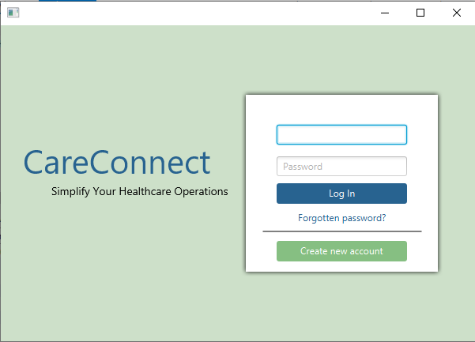
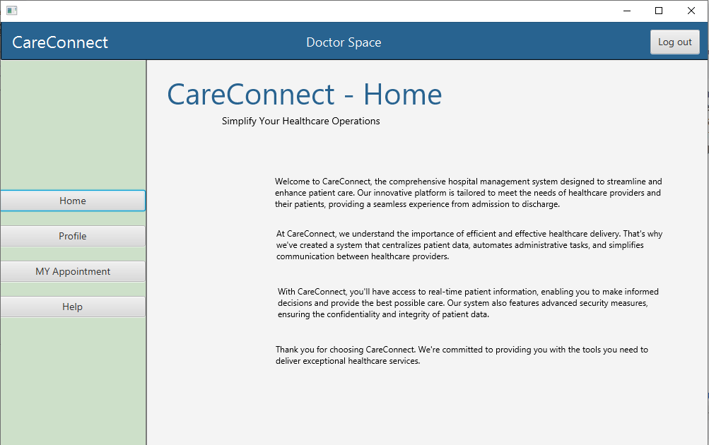

# CareConnet: Hospital Management System

CareConnet is a hospital management system built using Eclipse, JavaFX, and Scene Builder. It provides a comprehensive solution for managing different aspects of a hospital, including patient registration, appointment scheduling, doctor and staff management, inventory management, billing, and reporting.

## Installation

To install CareConnet, follow these steps:

1. Clone the repository from GitHub.
2. Import the project into Eclipse IDE.
3. Make sure you have JavaFX and Scene Builder installed on your machine.
4. Run the project by selecting the `Main.java` file and clicking the "Run" button.

## Features

CareConnet provides the following features:

- Patient registration: Allows patients to register and create a profile with their personal information.

- Appointment scheduling: Allows patients to schedule appointments with doctors based on availability.

- Doctor and staff management: Allows hospital administrators to manage doctors and staff, including their personal information, work schedule, and patient interactions.

- Inventory management: Allows hospital administrators to manage inventory, including medications, medical supplies, and equipment.

- Billing: Generates bills and tracks payments from patients and insurance providers.

- Reporting: Generates reports on patient visits, staff performance, and financial performance.

## Technologies Used

CareConnet is built using the following technologies:

- Java
- JavaFX
- Scene Builder
- Eclipse IDE

## Contributors

The following contributors have contributed to the development of CareConnet:

- [Ismail Lagziri](https://github.com/ismail-lagziri)

## License

CareConnet is licensed under the MIT License. See `LICENSE` for more information.

## Contact

If you have any questions or comments, please contact us at [ismaillagziri1@gmail.com](mailto:ismaillagziri1@gmail.com).
